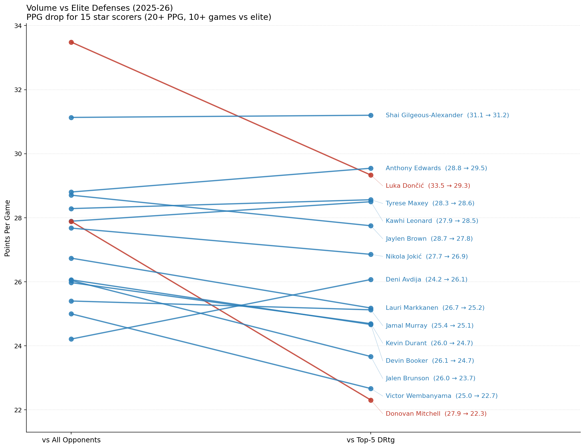
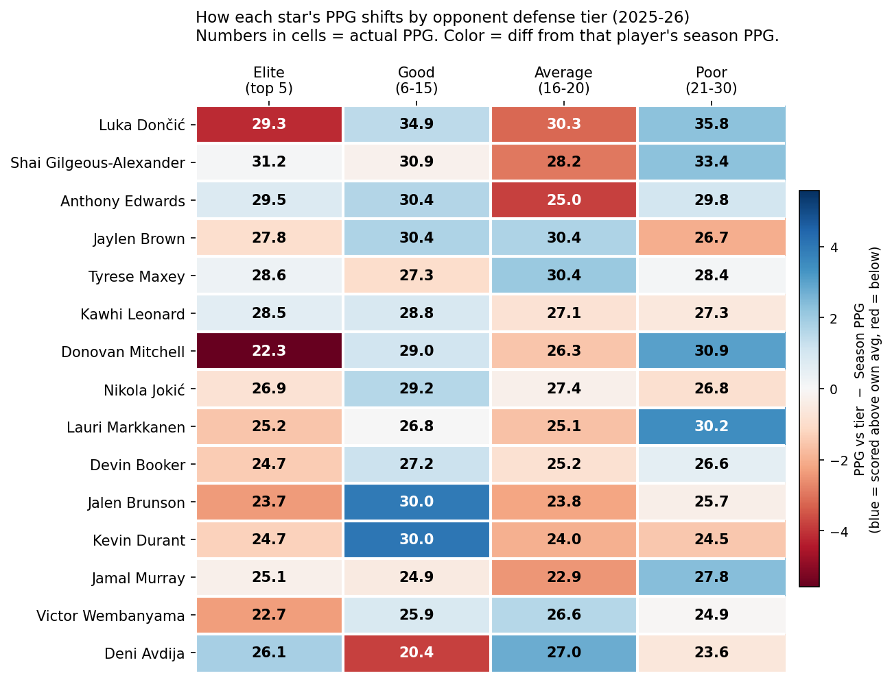
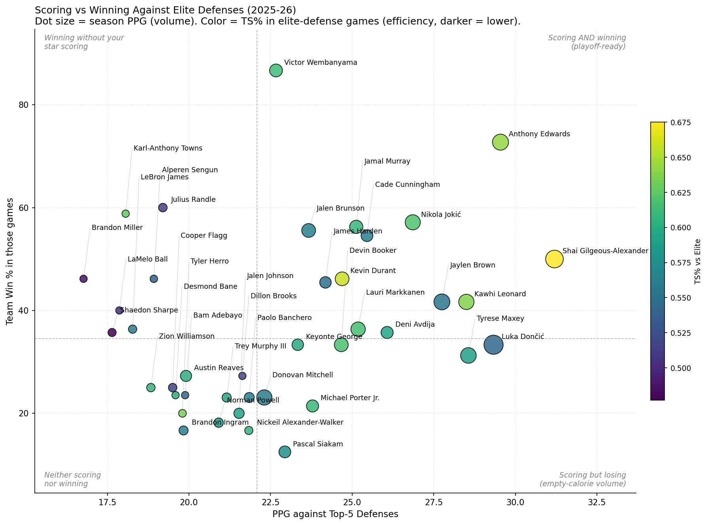

# Project 1 — Volume vs. Elite Defenses

**Question:** When star scorers face the league's best defenses, who actually keeps scoring and who quietly cashes regular-season checks?

**Headline answer:** Across 15 qualifying star scorers in 2025-26 (20+ PPG season-long, 10+ games against top-5 DRtg defenses), the *average* PPG drop against elite opponents is small — roughly 1.1 PPG. That league-average number is the wrong story. The real story is the spread:

- **Biggest faller:** Donovan Mitchell — drops from 27.9 to 22.3 PPG vs. elite. A 5.6-point collapse.
- **Steadiest superstar:** Shai Gilgeous-Alexander — 31.1 to 31.2. Literally does not drop.
- **The signal of the whole project:** Deni Avdija — 24.2 overall, 26.1 against elite. He scores *more* when the defense gets harder.

A GM building a contender doesn't care about the league average. They care about which of these 15 names belongs in each of those three buckets. That's what this analysis is for.

## Why it matters

Every playoff opponent is roughly elite. The teams you beat in March are not the teams you beat in May. A 28-PPG scorer whose game depends on attacking second-string defenses is a 22-PPG scorer in a playoff series — and you're still paying him as if he's 28. The point of this work is to flag that mismatch *before* the second-round series exposes it.

---

## Visualizations

### The headline drop
The slope chart shows each star's PPG against all opponents (left) versus their PPG against the top-5 DRtg defenses (right). Red lines mark drops of 3+ PPG. Blue lines are the players who hold up.



### Player × tier heatmap
One row per star, one column per opponent tier (Elite / Good / Average / Poor). Numbers inside cells are PPG against that tier. **Color is the gap between that PPG and the player's own season PPG** — red means below their average (the defender slowed them down), blue means above. The leftmost column is what matters for the playoff question.



### Scoring vs. winning against elite defenses
For each star, restricted to games against top-5 defenses: x-axis is their PPG in those games, y-axis is team Win % in those same games. Dot size = season PPG (volume). Dot color = TS% in elite-defense games (efficiency). Dashed lines split the chart at the medians.



Read the four quadrants:
- **Top-right** — scoring AND winning vs. elite. Playoff-ready.
- **Bottom-right** — scoring but losing. Empty-calorie volume.
- **Top-left** — winning without your star carrying the scoring load. Good supporting cast.
- **Bottom-left** — neither scoring nor winning.

---

## The eight players that tell the story

### Luka Dončić — 33.5 → 29.3 (−4.2)

A 4-PPG drop and he's still the scoring champion of the season. That's the punchline. The drop is real and the floor is still elite. Most players in this dataset would trade their season for Luka's worst tier.

The deeper read: Luka was traded to the Lakers mid-season, and a chunk of his elite-tier opponent games came in a Western Conference where four of the top five defenses live (Thunder, Wolves, Rockets, Magic-adjacent matchups). He didn't lose ground because he can't handle elite defense — he lost ground because the West is the elite. His pull-up three and free-throw rate don't get harder with better defenders; what gets harder is the help-defense traffic on his drives. That's what the 29.3 reflects.

Hypothesis: Luka's playoff PPG will out-pace his elite-tier regular-season number. His regular-season conditioning has always lagged his postseason intensity. The 29.3 is closer to a floor than a ceiling.

### Shai Gilgeous-Alexander — 31.1 → 31.2 (+0.1)

The graph confirms what the eye test screams. He doesn't drop. He never drops. Back-to-back MVP is not a fluke of voter narrative — it's this.

He said it himself on Netflix Starting 5 — 30 points is below his average. In the same promo: *"I'm not unstoppable, just very very very very very hard to stop."* The graph backs every word.

Why it holds: SGA's game is fouls and footwork. The mid-range stop-on-a-dime jumper, the bumps that draw whistles, the patience to get to his spot — none of that gets neutralized by better athletes. It gets neutralized by elite officiating discipline, which barely exists. He shoots 9-10 free throws a night against anyone. Volume isn't the question with SGA — it's whether anyone can change how he gets his.

Hypothesis: His drop in a playoff series will be even smaller than 0.1. Foul-drawing scales with stakes. Refs let more contact go in May, but they still call the obvious ones, and SGA only takes the obvious ones.

### Nikola Jokić & Jamal Murray — 27.7 → 26.9 (−0.8), 25.4 → 25.1 (−0.3)

Both essentially flat. The Nuggets show up in this dataset as exactly what they are: two All-Stars who don't have an off-night switch.

Jokić's case is structural. His scoring is post-ups, mid-range floaters from the elbow, and free throws — three skills that do not depend on athleticism, speed, or beating a defender to a spot. Elite defenses make every other player play faster; Jokić makes them play slower. The defense conforms to him, not the other way around.

Murray's case is matchup. He's the secondary creator in a system where the primary creator pulls all the defensive attention. His playoff résumé is already legendary (the 2023 title run); his regular-season elite-tier number being flat is the natural extension.

Hypothesis: This is a duo built specifically for the playoff question this analysis asks. If anyone embodies "matchup-resistant offense," it's the Murray/Jokić two-man game.

### Jaylen Brown — 28.7 → 27.8 (−0.9)

With Tatum on Achilles recovery and Jrue Holiday no longer in green, JB had to carry the offense for stretches this year. The graph confirms he didn't shrink in the spotlight.

The mechanic underneath the result: Brown's elite-tier scoring stays close to his season number because his bread-and-butter — mid-range pull-up, downhill drives, transition — is the same shot diet a playoff defense forces a primary scorer into anyway. He's not a player who pads numbers against bottom-tier defenses (his Poor-tier 26.7 is actually *below* his season average). He's a player whose shot profile is naturally playoff-shaped.

Hypothesis: This season is the season Jaylen Brown quietly proved he was a top-5 offensive option in any series. The 27.8 vs. elite — not the 28.7 vs. everyone — is the number that matters for next year's Celtics ceiling.

### Deni Avdija — 24.2 → 26.1 (+1.9) — *the key insight*

This one deserves the headline treatment. Avdija is the only player in the dataset whose elite-tier PPG is *meaningfully above* his season average. In a sample of 15 stars, the typical drop is 1-2 PPG. He gains 1.9.

The basketball read: Avdija is a 6'9" forward in Portland who can put the ball on the floor, switch onto wings, and shoot it. Against poor defenses you might see him punished for taking lower-leverage shots; against elite defenses, who are switching everything and forcing matchups into mismatches, he becomes the mismatch. He's the guy a switching defense doesn't want to leave on an island.

The caveat: 10-15 games is a small sample, and Avdija's +1.9 could partly be noise (one or two 30+ games against elite skew the mean). But the directional signal is too clean to ignore. Players with this archetype — versatile forwards who match up against everyone — have historically been undervalued going into their second contract.

Hypothesis: If Portland doesn't extend him on a team-friendly number this summer, somebody else will pay him like a borderline All-Star. The contract-value gap this analysis is built to find — Avdija's headed for the right side of it.

### Donovan Mitchell — 27.9 → 22.3 (−5.6) — *the cautionary tale*

The biggest drop in the dataset. By a lot. And the heatmap is even uglier than the slope chart suggests: against Elite he's 22.3, against Poor he's 30.9. That's an 8.6-PPG swing across opponent tier — a tell-tale signature of a volume scorer whose efficiency dips when the defense actually contests.

This isn't a takedown. Mitchell is a real shotmaker. But his profile — high-usage off-the-dribble three-point creator, plays a lot of pick-and-roll with secondary screeners — is exactly the profile elite defenses are built to suffocate. Switch the screen, ice the side pick, force him into contested twos. He's been on the wrong side of playoff exits for half a decade for the same reason.

The Cavs are a great regular-season team. The chart is asking whether they can be a great playoff team with Mitchell as the lead bucket-getter. The −5.6 PPG is the chart's answer: probably not without help.

Hypothesis: Cleveland's next move (trade, free agency, or scheme overhaul) will be about masking Mitchell's drop, not about denying it exists. The data is loud.

### Anthony Edwards — 28.8 → 29.5 (+0.7)

Hidden gold in the heatmap. Edwards joins SGA and Avdija in the tiny club of players who do *not* drop against elite defenses. And the scoring-vs-winning scatter pushes the case further: he's deep in the top-right quadrant — high PPG against elite *and* a high team win rate in those games.

This is the profile of an emerging top-5 offensive player. Edwards is 24, attacks downhill against length, and has shown improving touch from three. The fact that elite defenses don't slow him down at this age is a stronger signal than any award he's won so far.

Hypothesis: Edwards is one playoff run away from being the consensus pick to inherit the league's "best two-way wing" mantle as Tatum and Brown age. This chart is the leading indicator.

### Victor Wembanyama — 25.0 → 22.7 (−2.3)

A 2.3-PPG drop is a moderate one in this dataset, but the context is everything: he's 22 years old in his second season, and the chart already places him alongside grown-man scorers. The scoring-vs-winning scatter pushes him into the top-left quadrant — winning more than expected against elite defenses despite a lower PPG. Small sample, but a real signal.

The mechanic: Wemby's scoring against elite defenses comes mostly from putbacks, paint touches, and his face-up jumper. Against switch-everything defenses he hasn't yet developed the shot-creation tools (off-the-dribble three, deep post game) that he obviously will. The 22.7 is what he scores when the defense doesn't give him anything easy — and the Spurs still win those games.

Hypothesis: A year from now this analysis re-run on 2026-27 data shows Wemby's elite-tier PPG closer to his overall average. The trajectory matters more than the snapshot.

---

## Key findings

- **The league-average drop (~1.1 PPG) is the wrong number.** It hides a 7.5-PPG spread between the worst (Mitchell, −5.6) and the best (Avdija, +1.9). Variance is the insight.
- **Three players in the dataset don't drop at all against elite defenses:** SGA, Edwards, Avdija. Those are the names a GM would pay full price for in a playoff context.
- **Donovan Mitchell's heatmap row is the clearest contract-value flag in the data.** A 5.6 PPG drop is one signal; an 8.6 PPG swing across opponent tiers is a louder one.
- **The Nuggets and Celtics show up as systemically playoff-shaped offenses.** Jokić/Murray together drop a combined 1.1 PPG; Brown's profile is naturally elite-defense-tested. These rosters are built for the question this chart asks.
- **The "scoring vs. winning" scatter separates two kinds of volume scorers:** ones in the top-right (Edwards, SGA, Jokić) whose buckets correlate with wins, and ones in the bottom-right (the empty-calorie cluster) whose volume against elite defenses doesn't translate.

---

## Caveats

- **10-game minimum still leaves small samples.** Most players have 12-17 games vs. top-5 defenses. One 40-point outburst or one 12-point clunker can shift the mean by 1.5 PPG. The signal is directional, not surgical.
- **Season-long DRtg doesn't reflect mid-season changes.** Trades, injuries to defensive anchors, and lineup shifts can move a team's true defensive quality by 4-5 points in a single transaction. The Lakers, Mavs, and Suns all changed personnel this year in ways the season average smooths over.
- **PPG is volume, not efficiency.** A player can drop 3 PPG vs. elite while shooting just as well (fewer attempts, same percentages) — that's a usage shift, not a quality shift. The heatmap helps but doesn't fully separate the two.
- **Team Win % vs. elite reflects roster, not the player alone.** Wembanyama in the top-left isn't proof he wins games on his own; it's proof his team wins when he's on the floor against good defenses. Small sample, real signal, not a verdict.
- **Pace differences are not adjusted.** Elite defenses tend to play slightly slower. Some of every player's "drop" is just fewer possessions.

---

## Method

- Pulled every player-game log for the 2025-26 NBA regular season via the official NBA Stats API (`nba_api` library).
- Pulled team Defensive Rating (DRtg) for all 30 teams from the same source.
- Joined each game to the opponent's season DRtg by team ID.
- Bucketed opponents into four tiers by DRtg rank: Elite (1-5), Good (6-15), Average (16-20), Poor (21-30).
- Aggregated per player per tier: PPG, TS%, and team Win %.
- Filtered to qualifying star scorers: 20+ PPG season-long *and* 10+ games against top-5 defenses.

## Data

- **Source:** NBA.com official stats API (via `nba_api`)
- **Season:** 2025-26 regular season
- **Endpoints used:** `leaguedashteamstats` (team DRtg), `leaguegamelog` (per-game player stats)
- **Sample:** 30 teams; ~27,000 player-game rows; 15 qualifying star scorers in the final analysis

## Reproduce

```bash
pip install -r requirements.txt
python src/analysis.py
```

Outputs land in `data/` (CSVs) and `figures/` (PNGs). Total runtime ~60-90 seconds depending on the NBA API.

## Future work

- Pool 2-3 seasons to grow the per-player sample size against elite defenses.
- Add pace-adjusted scoring (per-100-possessions) alongside PPG to separate volume from efficiency.
- Re-run the analysis using post-trade-deadline DRtg rather than full-season DRtg, so the elite tier reflects rosters as they actually play in the playoffs.
- Cross-reference each player's "drop vs. elite" with their *actual* playoff PPG in prior seasons to test whether this metric predicts post-season performance.
- Add usage rate to split "shooting worse vs. elite" from "shooting less vs. elite."
