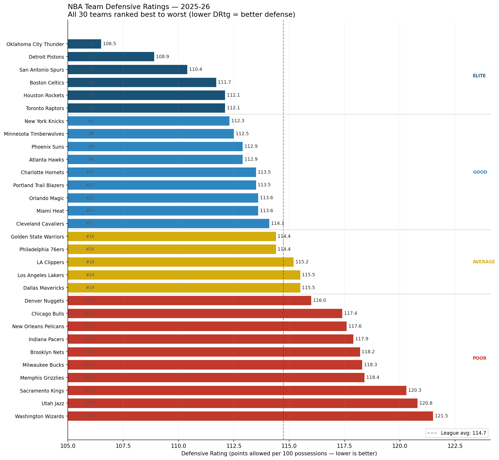

# Project 1 — Volume vs. Elite Defenses

**The question:** When star scorers face the league's best defenses, who actually keeps scoring and who just pads their numbers against weaker teams?

**The headline:** I looked at 15 star scorers from the 2025-26 NBA regular season — every player who averaged 20+ points per game and played at least 10 games against a top-5 defense. On average, they scored about 1 point per game less against elite defenses than they did across the whole season. That sounds like nothing.

But the average is misleading. The real story is how *different* the 15 players are from each other:

- **Biggest drop:** Donovan Mitchell — 27.9 PPG overall, but only 22.3 against elite defenses. He loses **5.6 points** every time the defense is good.
- **Doesn't drop at all:** Shai Gilgeous-Alexander — 31.1 overall, 31.2 against elite. Same player on every night.
- **Actually goes up:** Deni Avdija — 24.2 overall, 26.1 against elite. He scores *more* when the defense gets harder. That's the most interesting finding in the whole dataset.

A general manager building for the playoffs doesn't care about a league average. They care about which of these 15 names belongs in each bucket. That's the point of this analysis.

## Why this matters

In the playoffs, every team you face is roughly elite. The bad defenses go home in April. So if your max-contract scorer averages 28 points per game during the regular season but drops to 22 when the defense is actually good, you're paying him as a 28-point scorer for a series where he's really a 22-point scorer. That's a contract-value mistake worth tens of millions of dollars.

This project is built to flag that mismatch *before* a playoff series exposes it.

---

## What the charts show

### 0. Team defensive rating ranking — all 30 teams
Every team in the 2025-26 NBA regular season, ranked #1 (best defense) to #30 (worst), by Defensive Rating (points allowed per 100 possessions). Bars are color-coded by tier: **deep blue** = Elite (top 5), **steel blue** = Good (6-15), **amber** = Average (16-20), **red** = Poor (21-30). A dashed line marks the league average. This is the classification that powers every other chart in the project — it shows exactly which teams count as "elite defenses" for the analysis.



### 1. The headline drop
For each star, two dots — their PPG against all opponents (left) and their PPG against the top-5 defenses (right) — connected by a line. **Red lines** are players who drop 3+ points. **Blue lines** are players who hold up.


### 2. Player × tier heatmap
Each row is a player. Each column is a tier of defense: Elite (the top 5), Good (ranks 6-15), Average (16-20), Poor (21-30). The number inside each cell is the player's PPG against that tier.

**The color is the most important part.** It shows the *gap* between that PPG and the player's own season average. Red means "scored below his average against this tier of defense." Blue means "scored above." The Elite column is the one that matters for the playoff question.


### 3. Scoring vs. winning against elite defenses
This one only looks at the games each player played against top-5 defenses. The x-axis is their PPG in those games. The y-axis is their team's win percentage in those same games. Dot size is their full-season PPG (the volume scorers are the big dots). Dot color is their shooting efficiency in those games — brighter is better.


The dashed lines split the chart into four corners:

- **Top-right** — scoring AND winning against elite defenses. These are the playoff-ready stars.
- **Bottom-right** — scoring but losing. Empty-calorie volume.
- **Top-left** — winning without your star carrying the scoring. Strong supporting cast.
- **Bottom-left** — neither scoring nor winning.

---

## The eight players that tell the story

### Luka Dončić — drops from 33.5 to 29.3 (−4.2)

A 4-point drop and he's still the scoring champion of the season. That's the punchline. The drop is real, but the floor is still elite. Most players in this dataset would trade their whole season to have Luka's *worst* tier.

The context matters. Luka was traded from Dallas to the Lakers in February 2025 — so 2025-26 is his first full season as a Laker, with a roster built around him from day one. The Lakers play in the West, and four of the five best defenses this season live in the West (Thunder, Wolves, Rockets, and the rest of the contenders). So a big chunk of his "elite-defense" games came against the toughest conference, on a team still figuring out its rhythm.

Luka's pull-up three and his foul-drawing don't get harder when the defender is better. What gets harder is the help defense — the second and third defenders who collapse when he drives. That's what the 29.3 reflects: not that he can't score against elite defenders one-on-one, but that he sees more bodies in the paint when the whole defense is good.

**My hypothesis:** Luka's playoff PPG will be higher than his elite-defense regular-season number. He's a different player when the games matter, every year. The 29.3 is his floor, not his ceiling.

### Shai Gilgeous-Alexander — 31.1 → 31.2 (+0.1)

He doesn't drop. Not one point. Back-to-back MVP isn't a voter narrative — it's this graph.

He said it himself on Netflix's *Starting 5*: 30 points is below his average. In the same promo he said *"I'm not unstoppable, just very, very, very, very, very hard to stop."* The graph backs every word.

Why his game holds up against any defense: SGA scores with footwork and contact. The mid-range pull-up, the in-and-out dribble that gets him to his spot, the patience that draws fouls. None of that gets neutralized by better athletes — it gets neutralized by referees swallowing their whistles, which never really happens. He shoots 9 or 10 free throws every night, against whoever is in front of him. The question with SGA isn't whether he'll score his usual number. It's whether anyone has ever found a way to change *how* he scores.

**My hypothesis:** His drop in a playoff series will be even smaller than 0.1. Free throws are the most playoff-proof source of points, and his entire game is built around drawing them.

### Nikola Jokić & Jamal Murray — 27.7 → 26.9 (−0.8), 25.4 → 25.1 (−0.3)

Both basically flat. The Nuggets show up in the data as exactly what they are: two All-Stars who don't have a bad night against good defenses.

Jokić is a special case. His scoring comes from post-ups, mid-range floaters from the elbow, and free throws — three skills that don't require him to be faster or more athletic than anyone. Elite defenses make every other player rush; Jokić makes them slow down to his pace. The defense adapts to him, not the other way around.

Murray is the secondary creator in a system where Jokić draws all the defensive attention. He doesn't need to break a great defense by himself — he just needs to make the shot when Jokić's passing puts him in space. His 2023 championship run already proved he's a playoff scorer. This regular-season number being flat against elite defenses is the same story, told a different way.

**My hypothesis:** This duo was designed to answer this exact question. If anyone embodies "scoring that doesn't depend on the matchup," it's the Murray-Jokić two-man game.

### Jaylen Brown — 28.7 → 27.8 (−0.9)

With Tatum recovering from his Achilles tear and Jrue Holiday no longer on the team, Brown had to carry the Boston offense for big stretches of this season. He didn't shrink in the spotlight — the graph shows a less-than-1-point drop against elite defenses.

What's interesting is *how* he holds up. Brown's main offense is the mid-range pull-up, downhill drives, and transition baskets. That's already a "playoff-shaped" shot diet — exactly what a good defense forces a primary scorer into. Some players pad their numbers against bad defenses by feasting on easy looks; Brown's 26.7 PPG against the *Poor* tier is actually *below* his season average. He's not a stat-padder against weak opponents. He's a player whose game looks the same whether the defense is good or bad.

**My hypothesis:** This is the season Jaylen Brown quietly became a top-5 offensive option in the league. The 27.8 against elite defenses — not the 28.7 against everyone — is the number Boston should plan around for next year.

### Deni Avdija — 24.2 → 26.1 (+1.9) — *the most interesting finding*

This is the headline. Avdija is the only player in the 15-player sample whose PPG goes *up* meaningfully against elite defenses. While the typical star loses 1 or 2 points against the league's best, Avdija gains 1.9.

The basketball read: Avdija is a 6'9" forward in Portland who can put the ball on the floor, switch onto wings, and shoot. Against weaker defenses he sometimes settles for lower-quality shots. But against elite defenses — the ones that switch every screen, the ones that try to create mismatches — he *becomes* the mismatch. He's the guy a switching defense doesn't want to leave on an island against a smaller guard.

To be fair to the data: 12-15 games against elite defenses is a small sample, and the +1.9 could partly be one or two huge games inflating the average. But the direction is too clean to ignore. Players with his archetype — versatile forwards who can score against any matchup — have historically been underpaid going into their second NBA contract.

**My hypothesis:** If Portland doesn't lock him up this summer on a team-friendly deal, another team will pay him like a borderline All-Star within the next 12 months. This chart is the early signal.

### Donovan Mitchell — 27.9 → 22.3 (−5.6) — *the cautionary tale*

The biggest drop in the dataset, by a wide margin. And the heatmap is even uglier than the slope chart suggests: 22.3 against Elite, 30.9 against Poor. That's an 8.6-point swing between his best and worst opponent tier — a classic sign of a volume scorer whose efficiency drops when the defense actually fights him.

This isn't a takedown. Mitchell is a real shotmaker. But his profile — high-usage off-the-dribble three-point creator, lots of pick-and-roll — is exactly what an elite defense is built to take away. Switch the screen, push the ball-handler to his weaker side, force him into a contested two. Mitchell has been on the wrong side of playoff exits for half a decade now, often for the same reason.

The Cavaliers are a top regular-season team. The question this chart raises is whether they can be a top *playoff* team with Mitchell as their main bucket-getter. The −5.6 drop is the chart's honest answer: probably not, not without help.

**My hypothesis:** Cleveland's next big move — trade, free agency signing, or scheme change — will be about masking Mitchell's drop, not denying it. The data is too loud to ignore.

### Anthony Edwards — 28.8 → 29.5 (+0.7)

Hidden in plain sight. Edwards joins SGA and Avdija in the small group of players who don't drop at all against elite defenses. And the scoring-vs-winning chart adds more weight: he's deep in the top-right corner. He scores against elite defenses *and* his team wins those games.

This is the profile of a player on the verge of being a top-5 offensive talent in the NBA. Edwards is 24, attacks the rim against length, and has shown improving touch from three-point range. The fact that elite defenses don't slow him down at this age is a stronger signal than any individual award he could win this year.

**My hypothesis:** Edwards is one deep playoff run away from being the consensus pick to inherit the "best two-way wing in the league" title as Tatum and Brown get older. This chart is the leading indicator that he's already there in volume terms.

### Victor Wembanyama — 25.0 → 22.7 (−2.3)

A 2.3-point drop is moderate for this dataset, but the context is everything: this is Wemby's *third* NBA season, and he's already 25 PPG with this kind of resilience against the best defenses. He's 22 years old and the chart already places him alongside grown-man scorers.

In the scoring-vs-winning scatter, he's in the top-left corner — the Spurs win more than expected against elite defenses despite him not putting up huge numbers. Small sample, but a real signal.

How he scores against elite defenses is mostly putbacks, paint touches, and his face-up jumper. Against switching defenses he hasn't yet developed the off-the-dribble three or the deep post game he'll obviously have in two years. The 22.7 is what he scores when the defense doesn't hand him anything easy — and the Spurs still win those games.

**My hypothesis:** Run this analysis again on 2026-27 data and Wemby's elite-tier PPG will be much closer to his overall average. With him, the trajectory matters more than any single year's snapshot.

---

## Key findings

- **The league-average drop (~1.1 PPG) hides everything important.** The real story is a 7.5-PPG spread between the worst case (Mitchell, −5.6) and the best (Avdija, +1.9). That spread is the analysis.
- **Three players in the dataset don't drop at all against elite defenses:** SGA, Edwards, and Avdija. Those are the names a smart GM would pay full price for in a playoff-value context.
- **Donovan Mitchell's row in the heatmap is the loudest contract-value flag in the data.** A 5.6-point drop is one signal. An 8.6-point swing between his best and worst tier is louder.
- **The Nuggets and Celtics show up as systemically playoff-shaped offenses.** Jokić + Murray drop a combined 1.1 PPG against elite. Brown's shot profile is naturally playoff-ready. These rosters are built for the exact question this chart asks.
- **The scoring-vs-winning chart separates two kinds of high-volume scorers:** the top-right group (Edwards, SGA, Jokić) whose buckets actually correlate with team wins, and the bottom-right group whose volume against elite defenses doesn't translate into wins.

---

## Caveats

- **The 10-game minimum still leaves small samples.** Most players in the dataset have 12-17 games against top-5 defenses. One 40-point outburst or one 12-point clunker can move the mean by more than a full PPG. The signal is directional, not surgical.
- **Season-long Defensive Rating doesn't capture mid-season change.** Trades, injuries to key defenders, and lineup shifts can move a team's true defensive quality by 4-5 points after a single transaction. The Lakers, Mavs, and Suns all changed pieces this year in ways the season average smooths over.
- **PPG measures volume, not efficiency.** A player can drop 3 PPG against elite defenses while shooting just as well (fewer attempts, same percentages) — that's a usage shift, not a quality shift. The heatmap helps with this but doesn't fully separate the two.
- **Team Win % against elite defenses reflects the whole roster, not just the player.** Wembanyama landing in the top-left isn't proof he wins games on his own. It's proof his team wins when he's on the floor against good defenses. Small sample, real signal, not a verdict.
- **No pace adjustment.** Elite defenses tend to play slightly slower games. Some of every player's "drop" is just fewer possessions, not worse scoring.

---

## Method

- Pulled every player's game-by-game stats for the 2025-26 NBA regular season using the official NBA Stats API (via the `nba_api` Python library).
- Pulled each team's full-season Defensive Rating (DRtg = points allowed per 100 possessions) from the same source.
- Joined every game in the dataset to the opposing team's season DRtg.
- Sorted the 30 teams into four tiers by DRtg rank: Elite (1-5), Good (6-15), Average (16-20), Poor (21-30).
- For each player, computed PPG, True Shooting % (a scoring efficiency stat that adjusts for 3-pointers and free throws), and team Win % within each tier.
- Filtered to qualifying star scorers — anyone averaging 20+ PPG for the season *and* who played at least 10 games against a top-5 defense.

## Data

- **Source:** NBA.com official stats API (accessed through the `nba_api` Python library — the standard open-source tool for this data).
- **Season:** 2025-26 regular season.
- **Endpoints used:** `leaguedashteamstats` (for team Defensive Rating), `leaguegamelog` (for every player's game-by-game log).
- **Sample size:** 30 teams; about 27,000 player-game rows; 15 qualifying star scorers in the final analysis.

## Reproduce

```bash
pip install -r requirements.txt
python src/analysis.py
```

All outputs land in `data/` (CSVs) and `figures/` (PNGs). Runtime is about 60-90 seconds, depending on how fast the NBA API responds.

## Future work

- Pool 2 or 3 seasons together to grow the per-player sample against elite defenses.
- Add pace-adjusted scoring (points per 100 possessions) alongside PPG to separate volume from efficiency.
- Re-run using post-trade-deadline DRtg instead of full-season DRtg, so the "elite" tier reflects the rosters actually facing each other in May.
- Cross-reference each player's "drop vs. elite" with their *actual* playoff PPG from previous seasons to test whether this metric predicts post-season performance.
- Add usage rate to separate "shooting worse against elite defenses" from "shooting less against them."
