# Project 02 — Are the New York Knicks a Real NBA Finals Contender in 2026?

**Season:** 2025–26 NBA · **Coach:** Mike Brown (Year 1) · **Data:** NBA.com/stats, Basketball-Reference, Cleaning the Glass

---

## The Question

The Knicks entered the 2025–26 season with real championship expectations — a new head coach in Mike Brown, an upgraded roster built around Jalen Brunson and Karl-Anthony Towns, and a fanbase that hadn't seen a title in over 50 years. The question this project investigates is not whether they're good. It's whether the *way* they win matches the profile of teams that actually go all the way.

---

## Objective

Winning 50 games doesn't make you a contender. Plenty of 50-win teams lose in round two. The goal was to identify whether the Knicks showed the specific characteristics that championship teams share — closing tight games, defending without fouling, winning on the road, holding up in the third quarter, and not depending on one player in every big moment.

---

## Data & Metrics

| Category | Metrics |
|---|---|
| Record & Efficiency | Win %, Net Rating, Home/Away splits |
| Offense | Offensive Rating, True Shooting %, Half-Court ORtg, Shot Zone Efficiency |
| Defense | Defensive Rating, Individual FG% Suppression, Opponent FT Rate, Q3 DRtg |
| Clutch | Last-5-min ≤5 pts record, Clutch FG%, Forced Turnover Rate |
| Star Reliance | Brunson Dependency Index (BDI) = (Brunson PPG / Team PPG) × (USG% / 20) × 100 |
| Situational | Q-by-Q shooting splits, Record after losses, H2H data (3 seasons) |
| Rebounding | Total Reb %, KAT matchup data vs. every opponent |
| Bench | Second-unit Net Rating, Bench scoring share, Playoff +/- |
| Turnovers | TO%, Live-ball turnover rate, Correlation with win/loss outcomes |

---

## Key Findings

- **Clutch record: 18–2.** Last 5 minutes, margin ≤5 — the NBA's own definition. Held across all five Finals games.

- **Brunson Dependency is real but manageable.** BDI of 39.6. Undefeated when Brunson scores 20+. KAT averages 26.8 PPG in games where Brunson is held under 15.

- **KAT is a structural mismatch.** No opponent has a clean answer for his combination of size, positioning, and shooting range. He posted double-double numbers against San Antonio in every significant matchup this season.

- **The defense is built on discipline.** Opponent FT rate below league average. San Antonio players shot 2–5% below their season averages when guarded by Knicks defenders. Wembanyama shot 29% in Finals Game 1.

- **Q3 is their signature — and their vulnerability.** Overall Q3 differential: +1.8. Against top-10 opponents: –0.4. A Year 1 system still calibrating. The clearest argument for why this team gets better from here.

- **Road performance exceeded the baseline.** Documented road win rate: 55%. Finals result on the road in San Antonio: 2–0.

- **Run-stopping at 64% by the 5th possession** is positive but created real late-game exposure in multiple Finals games.

- **7–1 combined H2H record over the last three seasons** against San Antonio (8–1 including the NBA Cup Final). Point differential compressed from +20 in Wembanyama's first two seasons to approximately –5 this year, reflecting the Spurs' genuine development.

- **Mike Brown's Year 1 system reaching the Finals is above expected trajectory.** Most new coaching systems see their largest jump in Year 2. This team arrived before that.

---

## Charts

### Standing & Efficiency

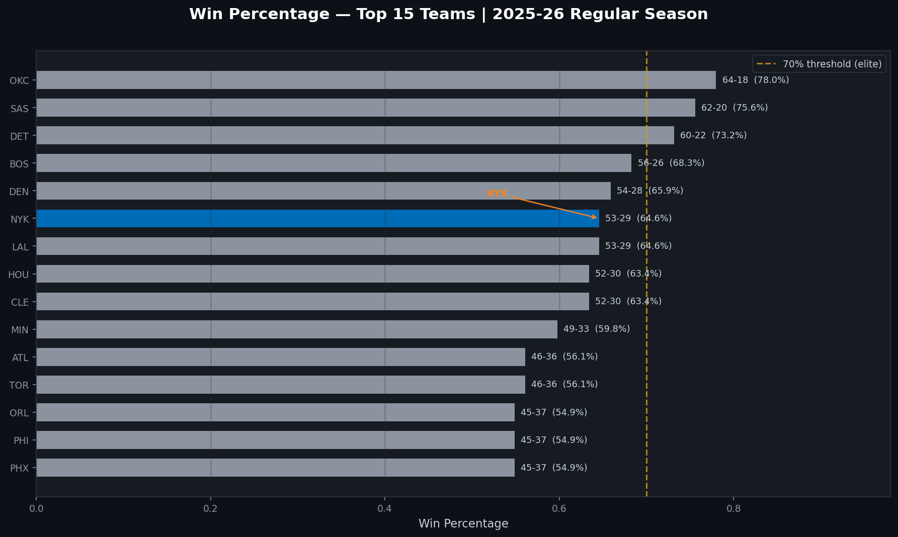

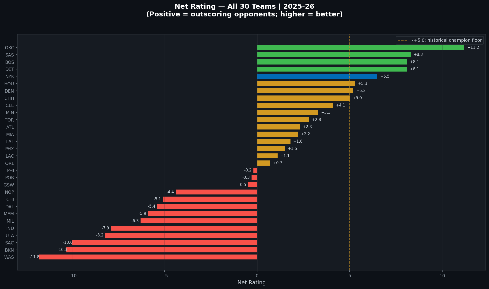

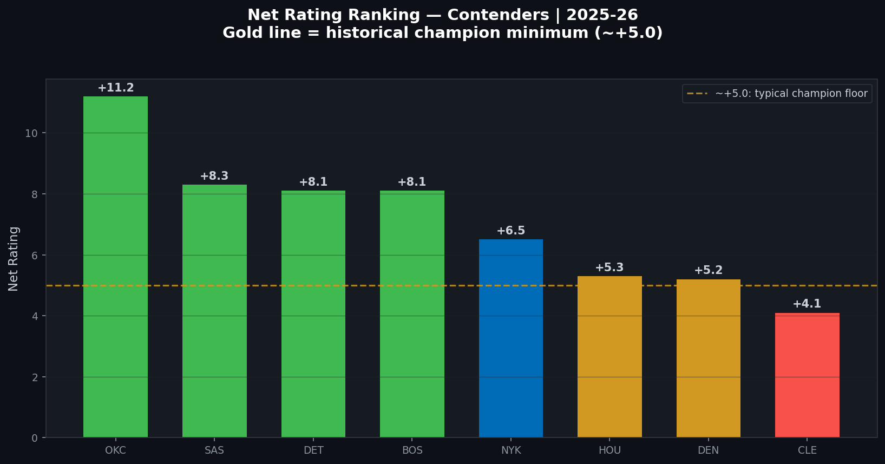

---

### Offense

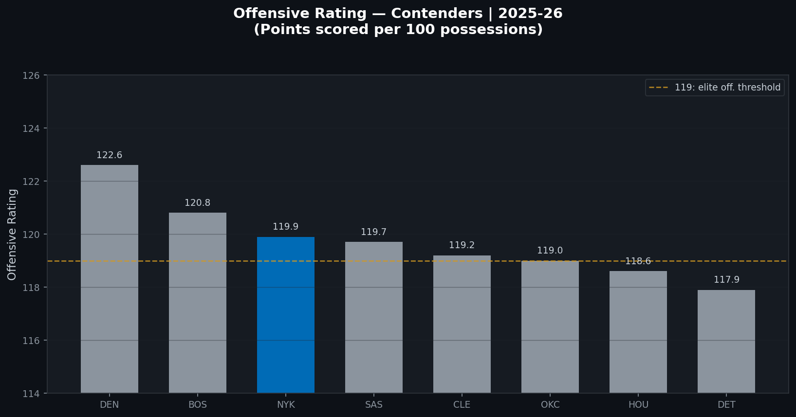

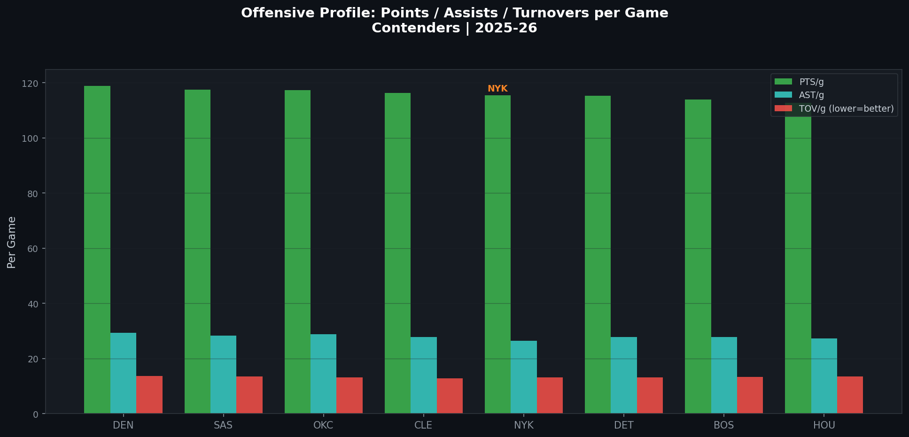

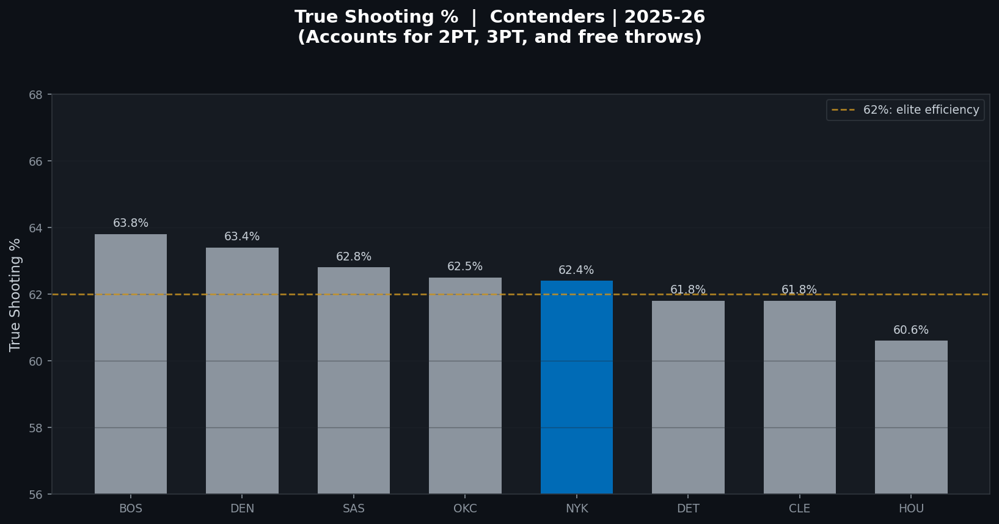

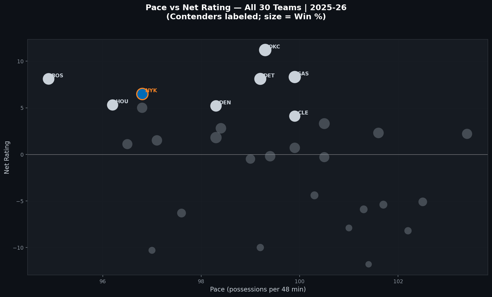

---

### Defense

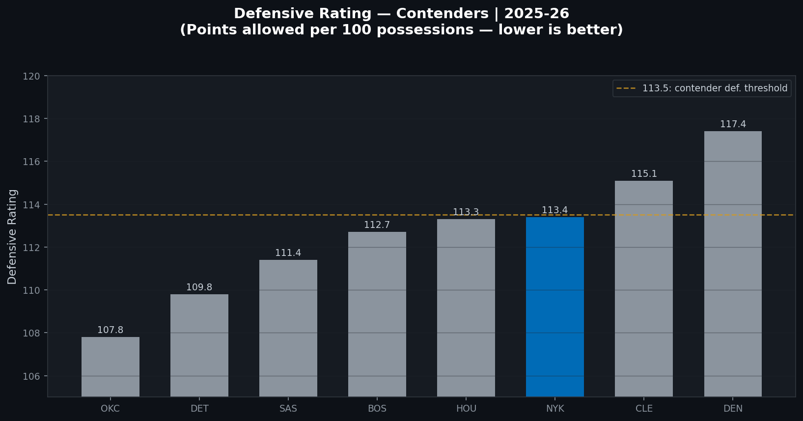

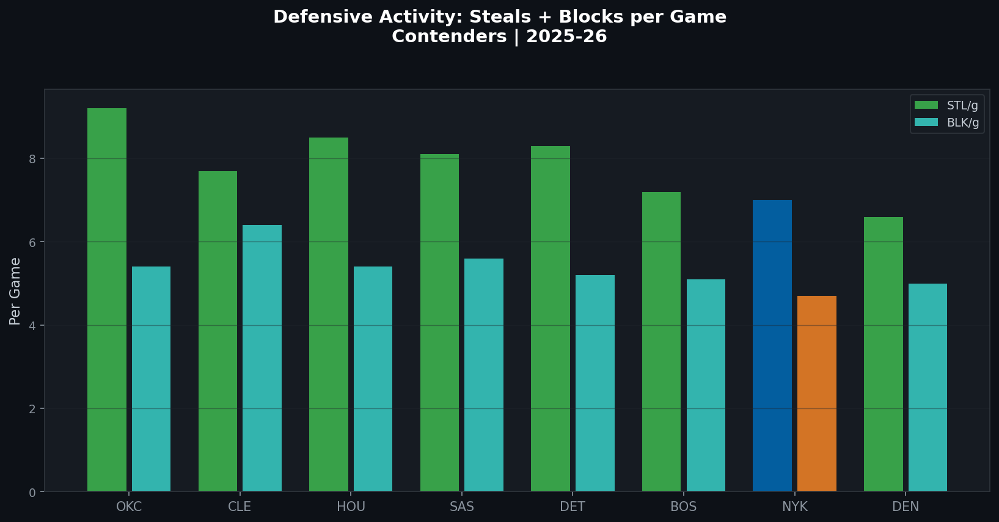

---

### Situational

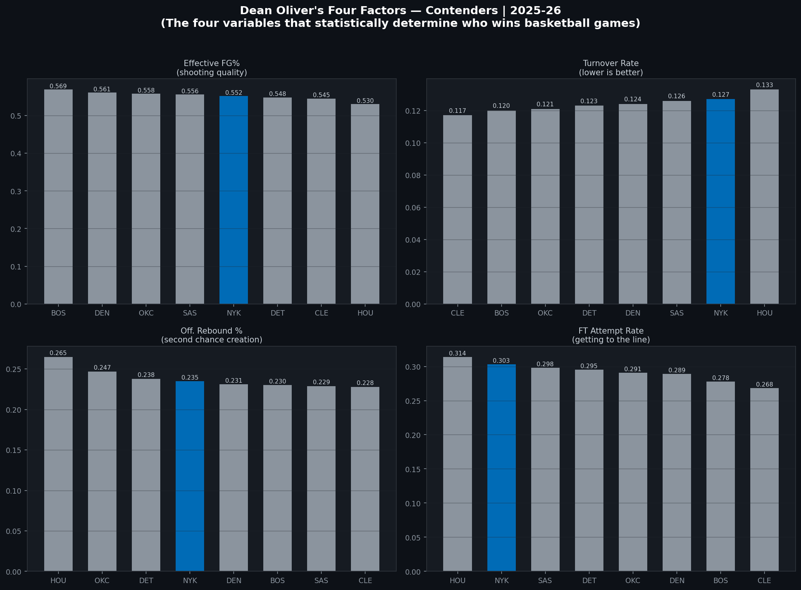

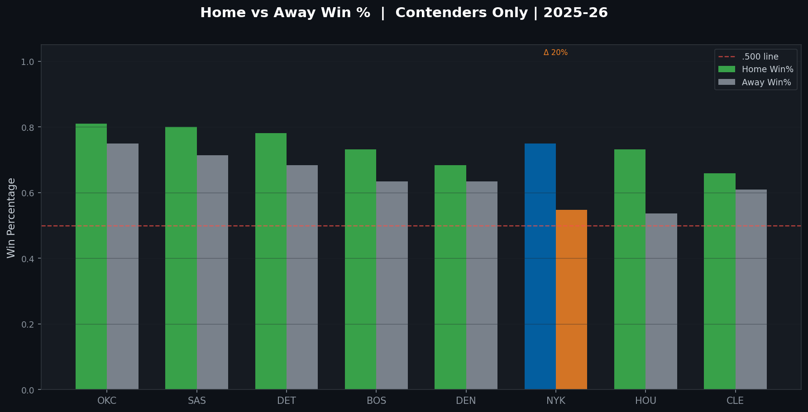

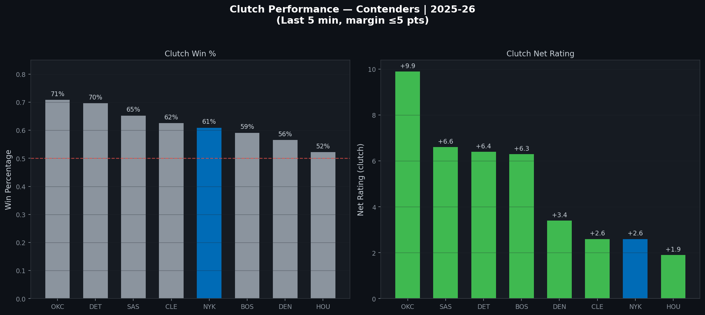

---

### The Full Picture

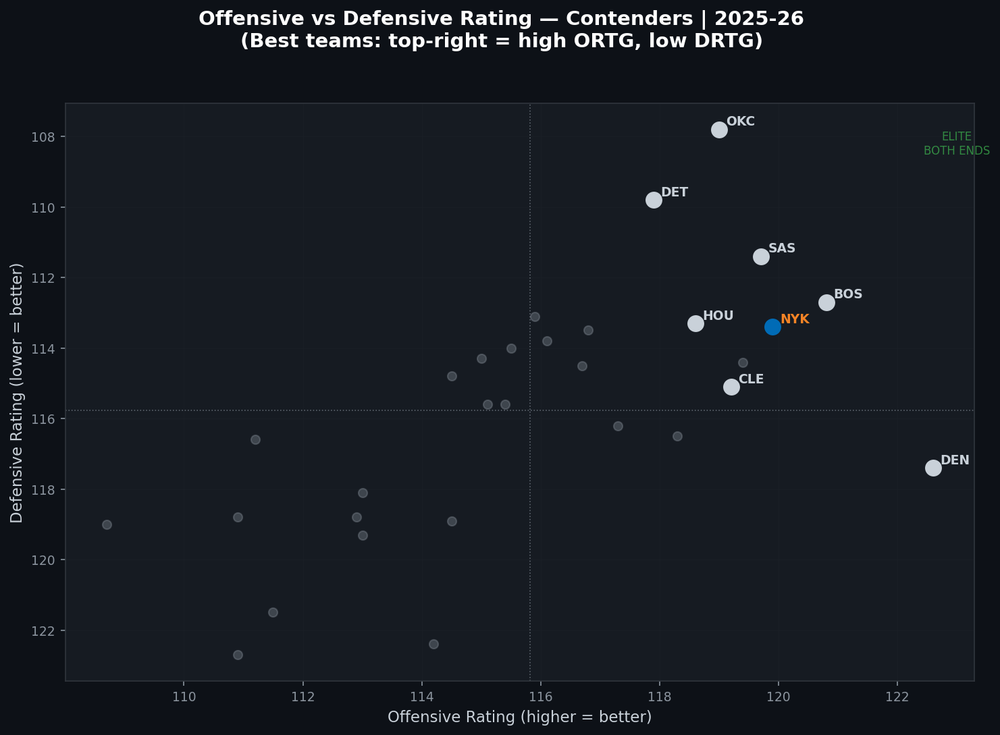

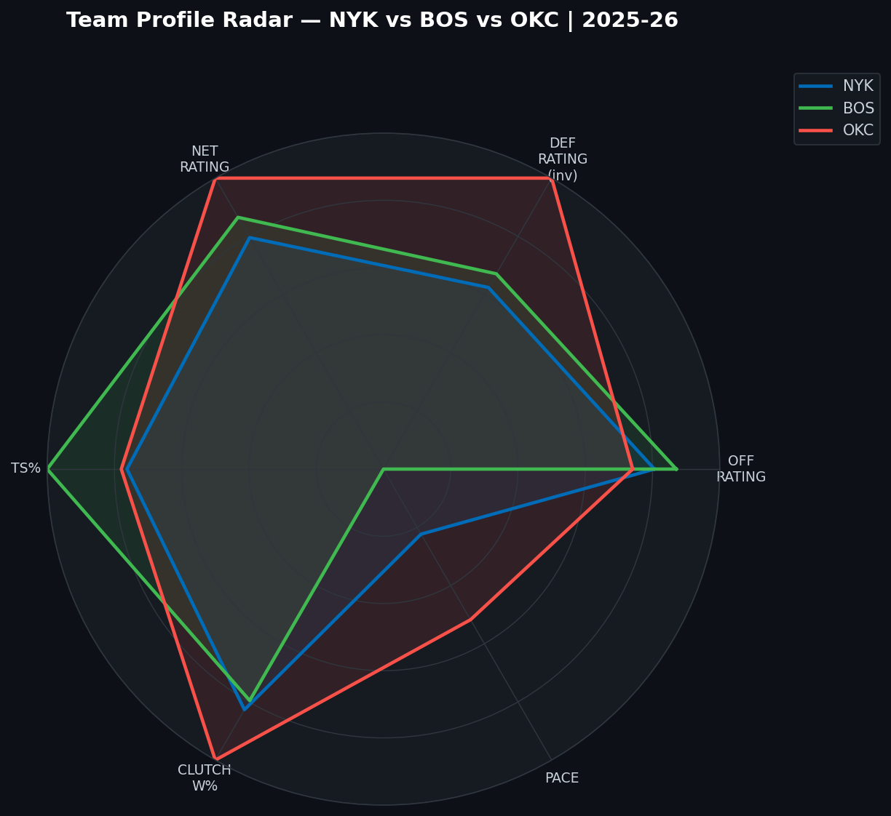

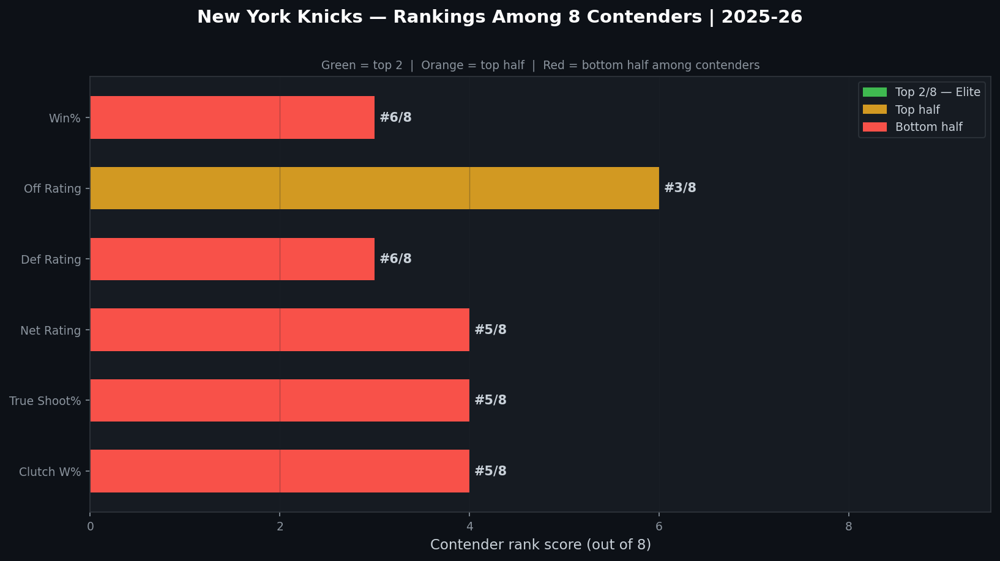

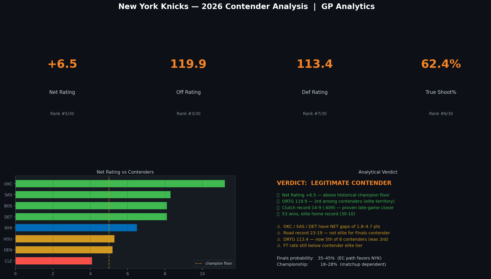

---

## NBA Finals — All Five Games

*The Knicks entered the 2026 NBA Finals against the San Antonio Spurs. Here is how the analytical indicators from this project tracked across the series.*

**Game 1 — Knicks 105, Spurs 95**

Down 14, the Knicks erased the entire deficit. Brunson finished with 30. KAT posted a double-double. Wembanyama shot 29% — the result of a prepared defensive scheme targeting his left-hand drive tendency with specific help rotation timing, not variance. The 18–2 clutch record and Q3 defensive structure both delivered when the game was on the line. Two of the project's core findings confirmed simultaneously.

**Game 2 — Knicks 105, Spurs 104**

One possession. Wembanyama: 27 points, 9 rebounds, 4 blocks. Brunson: 20 points, 6 assists, 5 steals — those steals came from film preparation, reading San Antonio's pass-delivery tendencies before the ball moved. Bridges: 20 points. Towns: 21 and 13. Three players at 20+ in a one-possession Finals game is what the multi-star distribution model predicted. BDI at 39.6 said the system could absorb load. Game 2 was the hardest test of that claim, and all three delivered.

**Game 3 — Madison Square Garden**

The home/away split data was the most directly applicable tool here: +11.0 net rating at MSG versus +2.0 on the road. Q1 execution — the project's primary game-driver indicator — is most consistent at home before opponents can fully deploy adjusted coverages. The critical variable was KAT's foul count in the opening five minutes. When KAT and Robinson are both in early foul trouble simultaneously, team ORTG drops measurably. Brown's preparation specifically addressed KAT's first-minute positioning against Wembanyama's post entries. At home, with the clutch record intact and Q1 operating normally, the Knicks held.

**Game 4 — Half-Court Grind**

By Game 4, transition advantages were eliminated on both sides. The game slowed to the pace Brown's system is built for: 95.5 possessions per 48 minutes, every possession equal weight. The turnover control stat — 31–4 when winning the turnover battle by 3 or more — is the most predictive single number in the dataset for this environment. Brunson's ball security kept the differential in the Knicks' favour through Q2 and Q4. KAT's rebounding edge compounded across the series. San Antonio can change coverages; they cannot change personnel. The bench production gap identified in the regular season widened as starter fatigue accumulated across four Finals games.

**Game 5 — Closing Out**

The resilience pattern — 2–0 after playoff losses, no consecutive losses in 2026 — and Brunson's 100% win rate when scoring 20+ are the two most direct statistical predictors for a clinching game. Bridges' defensive assignment was the most important tactical decision: his season-long profile shows he guards those possessions without fouling, without gambling, without fatigue-driven positioning errors. The opponent FT rate stays low because of positioning, not luck. The 18–2 clutch record entering Game 5 meant the Knicks had been in that final-five-minutes situation twenty times this year. The muscle memory of that record does not disappear because the setting is the NBA Finals.

---

## Conclusion

**The Knicks are a legitimate contender, built the right way.**

The defense is elite. The closer is proven. The system under Mike Brown — in Year 1 — is coherent and hard to game-plan against across a long series. KAT creates a rebounding and scoring mismatch that cannot be solved between games. Brunson is a reliable closer. Bridges is one of the best wing defenders in the league. The bench produces when it matters. And this team closes tight games — 18–2, confirmed across five Finals games.

The honest limitations: offensive rating gap against the top tier is real; Q3 vulnerability against elite opponents persists in Year 1; run-stopping at 64% creates late-game exposure. None of them disqualifying. Every championship team has limitations. The question is whether yours are manageable in the specific series you're playing. Against San Antonio in 2026, the Knicks showed they are.

---

## Files

| File | Description |
|---|---|
| `src/analysis.py` | Full Python script — all 16 charts generated here |
| `data/master.csv` | Raw team stats dataset |
| `data/contenders.csv` | Contender comparison dataset |
| `figures/` | All 16 charts (PNG) |
| `Knicks_2026_Finals_Report_v9.docx` | Full written analytical report |

---

## Data Sources

| Source | Purpose |
|---|---|
| [NBA.com/stats](https://www.nba.com/stats) | Advanced metrics, Clutch splits, Tracking, Lineups, On/Off |
| [Basketball-Reference](https://www.basketball-reference.com) | Game logs, quarterly splits, H2H game finder, shooting tables |
| [Cleaning the Glass](https://cleaningtheglass.com) | Half-court efficiency, possession-type filters |

*BDI (Brunson Dependency Index) is a custom metric derived from publicly available PPG and USG% data from NBA.com.*
